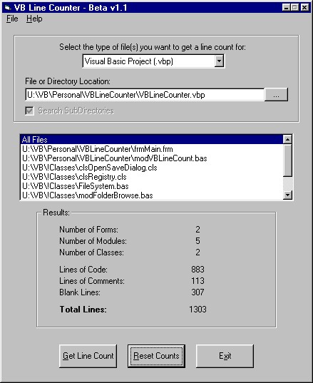



## Count the Number of Lines in your Code

### Description

UPDATE: Changed code so there is a listbox where you can select any file in a project or directory and get the number of lines of code. Also added an option to check all subdirectories when you are doing a directory search.

ORIGINAL: I was recently at an interview where I was asked how many lines of code I have writen. The question kind of caught me off guard -- I had no idea!! Ya, probably in the tens of thousands, but no real clue. That sparked the idea to make this application. With this app, you can specify a directory, a single file, or a VB project file, and it will analyze the data and tell you how many lines of code are in the project. This is the first beta release of the code, so please leave feedback if you encounter any bugs, or if you have any suggestions that I should add to my next version.

Just select the type of code you want to analyze from the dropdown box and select the location of the file.

The application will return to you:

1. The number of forms in the project

2. The number of modules in the project

3. The number of class modules in the project

4. The number of Blank Lines in the project

5. The number of Commented Lines in the project

6. The number of actual coded lines in the project

7. The total number of lines in the project

This is still a work in progress. I'm thinkin of adding as an output the number of procedures in the project. Maybe even break the numbers down per file. Please leave feedback and let me know what you think. If you like the code, please vote for it.
 
### More Info
 

             |
---                |---
**Submitted On**   |2001-05-17 11:50:06
**By**             |[N/A](https://github.com/Planet-Source-Code/PSCIndex/blob/master/ByAuthor/empty.md)
**Level**          |Intermediate
**User Rating**    |4.5 (85 globes from 19 users)
**Compatibility**  |VB 5\.0, VB 6\.0
**Category**       |[Complete Applications](https://github.com/Planet-Source-Code/PSCIndex/blob/master/ByCategory/complete-applications__1-27.md)
**World**          |[Visual Basic](https://github.com/Planet-Source-Code/PSCIndex/blob/master/ByWorld/visual-basic.md)
**Archive File**   |[Count the 197045172001\.zip](https://github.com/Planet-Source-Code/count-the-number-of-lines-in-your-code__1-23226/archive/master.zip)

